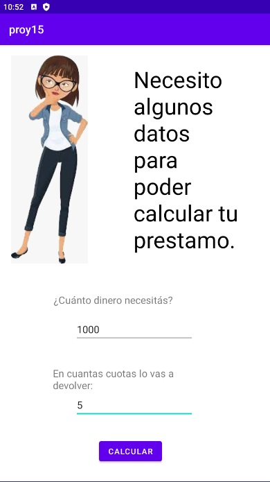
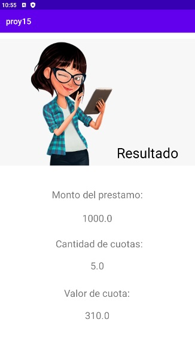

# Calculadora de Préstamos

La Calculadora de Préstamos es una aplicación de Android que te ayuda a calcular el valor de las cuotas de un préstamo según el monto del préstamo, la cantidad de cuotas y la tasa de interés.

## Capturas de Pantalla

1. **Pantalla de Bienvenida:**

   

   Al iniciar la aplicación, se muestra una pantalla de bienvenida que te da la bienvenida a la calculadora de préstamos.

2. **Ingresar Detalles del Préstamo:**

   

   En esta pantalla, puedes ingresar la cantidad de dinero que deseas recibir y la cantidad de cuotas en las que deseas pagar el préstamo.

3. **Resultado del Cálculo:**

   

   Después de ingresar los detalles del préstamo, la aplicación calcula automáticamente el valor de cada cuota, teniendo en cuenta la tasa de interés aplicable. Se muestran el monto del préstamo, la cantidad de cuotas a pagar y el valor de la cuota.